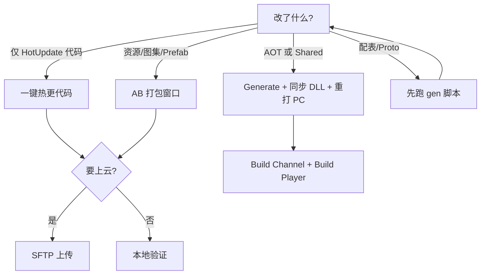

# CarrotFantasy 构建与热更 SOP

日常发布与本地迭代按本文操作。根 `README` 仅为项目简介，不覆盖本流程。

## 1. 心智模型

启动链路：

`GameMain`(AOT) → 资源更新(AB + HybridCLR DLL) → `HotUpdateEntry`(业务)

| 程序集 | 改动后通常要做什么 |
|--------|-------------------|
| `HotUpdate` | 代码热更即可，**不必**重打 PC 包 |
| `AOT` / `Shared` | 需要重打 PC Player；RebuildAdvisor 会提示 |
| 资源 / Prefab / 图集 | 走 AB 完整打包（可上传） |
| 配表 / Proto | 先跑外部脚本生成，再进 Unity |

默认产物目录：

- AB：`CarrotFantasy/Build/AssetBundles/{平台}/`
- PC 包常见：`CarrotFantasy/Build/PC/`
- 运行配置：`StreamingAssets/ab_runtime_config.json`（`env` = `dev` / `staging` / `prod`）

## 2. 日常场景速查

### A. 只改热更业务代码（最常用）

前置：该平台至少完整打过一次 AB（目录里要有 `hybridclr/` 等）。

1. `File → Build Settings`：激活平台与目标一致（如 Windows）
2. `Tools/HybridCLR/一键热更代码（Generate+同步+清单）`
3. 弹窗问是否上传 → 需要就上传（会传 `hybridclr/`、`packs/`、`custom_manifest.json`、`version.txt`）
4. 若弹出「是否需要重新打包 PC」：一般**只改 HotUpdate 可忽略**；AOT/Shared 变了才重打

### B. 改资源 / UI / Prefab

1. `Tools/AssetBundle/打开打包窗口`
2. 确认目标平台、版本号、CDN 模板
3. 建议勾选「构建前打包 UI 图集」
4. 执行构建（窗口内「构建」/强制重建）
5. 按需拷贝 StreamingAssets、询问上传
6. 同样可能触发 PC 重打建议（仅 AOT/Shared 变更时需理会）

### C. 改 AOT / Shared（启动壳、路径、宏相关）

1. 改完等编译
2. `Tools/HybridCLR/Generate All`（或走一键热更里的 Generate）
3. `Tools/HybridCLR/同步 DLL（StreamingAssets + AB 输出）`
4. 视情况刷新清单/Pack，或再跑一遍「一键热更代码」
5. **重打 PC 包**（见场景 E）
6. 打完后指纹会自动记录；也可手动：`Tools/HybridCLR/标记当前 AOT 已与 PC 包同步`

### D. 开发包 vs 正式包（PC）

| 目标 | 菜单 |
|------|------|
| 开发包（GM / 运行时 Log） | `Tools/Build Channel/准备开发 PC 包（启用 CF_DEV_TOOLS + env=dev）` |
| 正式包 | `Tools/Build Channel/准备正式 PC 包（禁用 CF_DEV_TOOLS + env=prod）` |
| **一键出包（推荐）** | `Tools/Build Channel/一键打开发 PC 包` / `一键打正式 PC 包` |
| 仅看状态 | `Tools/Build Channel/查看当前通道状态` |

一键出包会：写通道宏与 `env` →（若宏刚变则需等编译后再点一次）→ HybridCLR Generate/同步 DLL → `BuildPlayer`。

仅「准备」后也可手动：

1. 等待脚本编译完成
2. HybridCLR Generate + 同步 DLL
3. `File → Build Settings` 打 Windows 包

说明：`staging` 常量已有，菜单暂未单独暴露；Batch 可用 `-cfEnv=staging`（AB/热更），PC 一键出包目前只支持 `dev` / `prod`。

### E. 打 PC Player

**推荐**：场景 D 的一键菜单，或命令行 `.\Tools\pc-build.ps1 -Channel dev|prod`。

产物目录：`CarrotFantasy/Build/PC/{dev\|prod}/{yyyyMMdd-HHmmss}/CarrotFantasy.exe`  
（`productName` 为默认 `Unity` 时会改用 `CarrotFantasy.exe`）

校验：

- 开发包：`CF_DEV_TOOLS` 开、`env=dev`、Development Build
- 正式包：`CF_DEV_TOOLS` 关、`env=prod`、非 Development Build

成功后 `PcPlayerRebuildAdvisor` 会写指纹基线。

## 3. Editor 本地跑法

工具栏 / `GameLoadMode`（`LoadModeToolbarEditor`）：

| 模式 | 行为概要 |
|------|----------|
| Development / Debug | Editor 下**跳过**远程资源更新，方便本地迭代 |
| Testing | 可用本地 AB 清单，弱化远程依赖 |
| 其它 / Player | 走完整更新检查与下载 |

开发包 Player（带 `CF_DEV_TOOLS`）可进运行时 GM / Log 面板。

## 4. 配表与协议（Unity 外）

改表 / 改协议时，在进 Unity 或打热更前先生成：

- 配表（推荐唯一入口）：`ConfigTools/gen_code_json.bat`（详见 `ConfigTools/说明.txt`）
- 协议：`Tools/regen-game-network.ps1` 或 `Proto/regen-game-network.bat`

生成物入库策略需团队约定，避免本地生成不一致。

说明：热更用 HybridCLR。`Assets/ThirdParty/LitJson` 只是 JSON 库，与 ILRuntime 无关。

## 5. 常用菜单索引（均在 `Tools` 下）

| 分组 | 菜单 | 用途 |
|------|------|------|
| CarrotFantasy | `GM 工具` / `关卡刷怪表/…` | 业务 GM、刷怪表导入 |
| Build Channel | `准备…` / `一键打… PC 包` | PC 开发/正式通道与出包 |
| HybridCLR | `一键热更代码…` / `同步 DLL…` | 代码热更（项目封装） |
| AssetBundle | `打开打包窗口` / `管理清单` / `图集打包` | AB 构建与本地目录 |
| 资源 | Prefab 引用 / FBX / Animation | 资源处理 |
| 战斗 | Strip ItemCanvas… | 战斗相关批处理 |
| 编辑器 | 加载模式 / Game 点选 / SPACE 切换激活 | 日常编辑辅助 |

顶栏官方 `HybridCLR` 菜单仍保留（第三方包）；项目封装在 `Tools/HybridCLR`。

## 6. 决策简图



## 7. 命令行（Batch）

依赖本机已安装 Unity（含 HybridCLR），且工程能正常打开编译。上传仍读 Editor 里配置的 SFTP（`AssetBundleDeploySettings`）。

### 包装脚本

在仓库根目录执行（PowerShell）。若提示「禁止运行脚本」，用：

```powershell
powershell -ExecutionPolicy Bypass -File .\Tools\code-hotupdate.ps1
```

脚本内文案为 ASCII，避免 Windows PowerShell 5.1 在无 BOM UTF-8 下解析中文报错。

```powershell
# 指定 Unity.exe，或事先设置环境变量 UNITY_EDITOR
$env:UNITY_EDITOR = "C:\Program Files\Unity\Hub\Editor\2021.3.45f1\Editor\Unity.exe"

# 仅热更代码（需该平台已打过完整 AB）
.\Tools\unity-batch.ps1 -Command codeHotUpdate -Target StandaloneWindows64
.\Tools\code-hotupdate.ps1

# 完整 AB 打包
.\Tools\unity-batch.ps1 -Command abBuild -Target StandaloneWindows64
.\Tools\ab-build.ps1 -ForceRebuild

# 可选：上传 / 写入 env
.\Tools\unity-batch.ps1 -Command codeHotUpdate -Upload -RuntimeEnv prod
.\Tools\ab-build.ps1 -Upload -CopyStreaming -RuntimeEnv prod

# PC Player 一键出包（需 Build Settings 已是 Windows）
.\Tools\pc-build.ps1 -Channel dev
.\Tools\pc-build.ps1 -Channel prod
# 通道宏刚切换时脚本会自动重跑一次（退出码 2 → retry）
```

日志默认写到仓库根 `Logs/unity-batch-{command}-{时间戳}.log`。

### 退出码

| 码 | 含义 |
|----|------|
| 0 | 成功 |
| 2 | 仅 `pcBuild`：刚改 `CF_DEV_TOOLS`，需重跑；`pc-build.ps1` / `unity-batch.ps1` 会自动 retry 一次 |
| 其它非 0 | 失败（看日志；常见原因：激活平台不一致、尚未打过 AB、Generate/同步失败、正式包校验失败） |

### 底层参数（`-executeMethod`）

入口：`CarrotFantasy.Editor.Batch.BuildCli.Run`

| 参数 | 含义 | 默认 |
|------|------|------|
| `-cfCommand=` | `codeHotUpdate` / `abBuild` / `pcBuild` | 必填 |
| `-cfTarget=` | 如 `StandaloneWindows64` | batch 下默认 `StandaloneWindows64` |
| `-cfChannel=` | 仅 pcBuild：`dev` / `prod` | pcBuild 必填 |
| `-cfSkipGenerate=` | 仅 pcBuild：跳过 HybridCLR Generate/同步 | `false` |
| `-cfUpload=` | `true`/`false`（AB/代码热更） | `false` |
| `-cfEnv=` | `dev`/`staging`/`prod`（AB/热更写配置） | 不传则沿用流水线默认 |
| `-cfForceRebuild=` | 仅 abBuild | `false` |
| `-cfCopyStreaming=` | 仅 abBuild | `false` |

注意：`codeHotUpdate` / `abBuild` / `pcBuild` 要求 **Editor 激活平台已与目标一致**（脚本不会自动切平台）。Batch 模式下不弹 Dialog。

手工等价调用示例：

```text
Unity.exe -batchmode -nographics -quit -projectPath <CarrotFantasy> -logFile <log> -executeMethod CarrotFantasy.Editor.Batch.BuildCli.Run -cfCommand=codeHotUpdate -cfTarget=StandaloneWindows64

Unity.exe ... -executeMethod CarrotFantasy.Editor.Batch.BuildCli.Run -cfCommand=pcBuild -cfChannel=prod -cfTarget=StandaloneWindows64
```

## 8. 已知缺口

- 无 CI 流水线（可用本节脚本自行挂）
- 通道菜单目前偏 **PC Standalone**；微信小游戏等需另补
- `staging` 未产品化到 PC 一键出包（AB/热更 Batch 可用 `-cfEnv=staging`）
- 根 README 未展开描述本流程（见入口链接）
